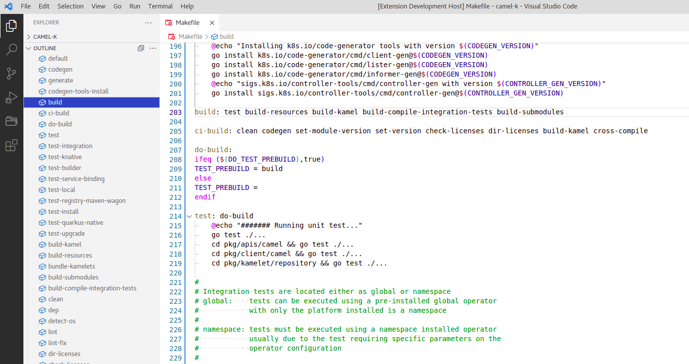

# Makefile Outliner VS Code Extension

This extension adds support for Makefile outline to VS Code.

## Features

* Show targets in VS Code Outline view
* Provide accessible symbols for "Go to Symbol in Editor..." command (`Ctrl+Shift+O`)
